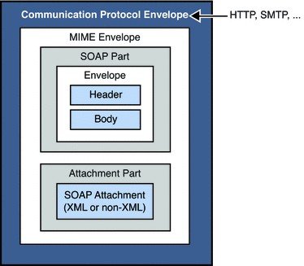

# Working with SOAP Messages

https://docs.oracle.com/cd/E19340-01/820-6767/aeqex/index.html

### SOAP Message Object

---

### SOAP Messaging Layers

---

### SOAP Interoperability

---

### SOAP Message Without Attachments

---

### SOAP Message with Attachments

---

